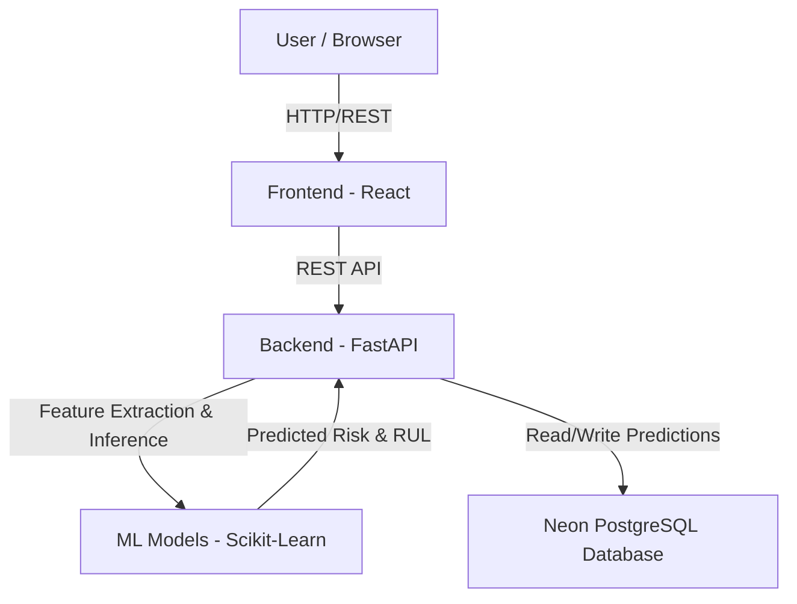

# 🚀 GridPulse AI

---

## 👥 Team
| Field | Value |
|---|---|
| **Team Name** | Achievers |
| **Track** | AI |
| **Team Lead** | Diksh Dharmendrabhai Trambadia — 24ce129@charusat.edu.in |
| **Members** | Henisha Jiteshkumar Vyas, Archit Nileshbhai Vaghasiya, Akash Vanmalibhai Unagar |

---

## 🎯 Problem Statement
Utility companies frequently face sudden, critical transformer failures that can lead to massive power grid outages. Identifying these failures before they occur is extremely difficult due to the complex interplay of internal sensor data (e.g., Dissolved Gas Analysis, load variance), external weather conditions, and component aging. Without early warning systems, maintenance is entirely reactive, leading to longer downtimes and higher repair costs.

---

## 💡 Solution
GridPulse AI is an AI-powered predictive maintenance and risk scoring platform. It synthesizes an Isolation Forest anomaly detector (for real-time sensor faults), an XGBoost Regressor (for thermal stress and weather impact), and a weighted Risk Scaling Algorithm. By converting complex machine learning outputs into a clean, prioritized risk index, grid operators can preemptively deploy maintenance crews to vulnerable substations before failure occurs.

---

## ✨ Key Features
- **Real-time Anomaly Detection:** Uses an Isolation Forest model to detect multi-variate sensor anomalies (e.g., Vibration, Insulation Resistance, Dissolved Gas).
- **Thermal Stress Prediction:** An XGBoost Regressor predicts the baseline transformer temperature given ambient weather context (temperature, humidity, wind) to highlight dangerous thermal deltas.
- **Weighted Risk Index Algorithm:** Synthesizes ML failure probabilities (60% weight) with community impact severity (40% weight - e.g., hospitals connected) to generate a prioritized 0-100 risk index.
- **Explainable AI Insights:** Unveils the top physical risk factors and deterministic explanations to empower maintenance crews with actionable context.
- **Pre-positioning Dispatch:** A beautiful, responsive dashboard allowing operators to preemptively dispatch crews to high-risk substations before peak weather stress windows hit.

---

## 🏗️ Architecture

### System Architecture



### Components

| Component | Technology | Responsibility |
|---|---|---|
| Frontend | React (Vite) + Tailwind CSS | Interactive dashboard, real-time crew dispatching, and asset monitoring. |
| Backend API | Python FastAPI | High-performance business logic, data routing, and ML model inference orchestration. |
| AI / ML | Scikit-Learn (HistGradientBoosting) | Analyzes 420-step DGA telemetry to predict Fault Detection (FDD) and Remaining Useful Life (RUL). |
| Database | Neon Serverless PostgreSQL | Cloud-native storage for raw telemetry, ML predictions, and completed dispatch work history. |

### Data Flow

1. Raw Dissolved Gas Analysis (DGA) telemetry is fed into the system via the UI (or seeding script).
2. The FastAPI backend converts the raw telemetry into an 82-feature temporal dataset.
3. The data is passed to the locally-hosted Scikit-Learn models (`fdd_model.pkl` and `rul_model.pkl`) for real-time inference.
4. The backend calculates a final 0-100 Risk Index and saves the raw data and predictions to the **Neon PostgreSQL** database.
5. The React frontend polls the `/api/assets` endpoint and displays the prioritized anomalies.

### Security Considerations

- Database connection strings are secured and should be migrated to environment variables (`.env`).
- API CORS policies are strictly configured for the frontend origin.

### Scalability Notes

The FastAPI backend is entirely stateless and can be horizontally scaled behind a load balancer. The Neon Serverless PostgreSQL database automatically scales computing resources based on query load, making this architecture highly robust for production-level utility grids.

---

## 💻 Tech Stack
| Category | Technologies |
|---|---|
| **Languages** | Python, TypeScript |
| **Frameworks** | FastAPI, React (Vite) |
| **Databases** | Neon Serverless PostgreSQL |
| **Other** | Tailwind CSS, scikit-learn, Pandas |

---

## 📁 Repository Structure
```
├── src/
│   ├── Backend/          # Python FastAPI backend & ML models
│   │   ├── ml_model/     # Jupyter Notebooks and trained .pkl files
│   │   └── api/          # FastAPI routes
│   └── Frontend/         # React + Vite application
│       ├── src/          # UI Components, Styles, and API integration
│       └── public/       # Static Assets
└── README.md             # This submission file
```

---

## 🚀 How to Run

### Backend (Python/FastAPI)
```bash
# 1. Navigate to the backend directory
cd src/Backend/ml_model

# 2. Install dependencies
pip install -r requirements.txt

# 3. Start the API server
python -m uvicorn api.main:app --host 127.0.0.1 --port 8000 --reload
```

### Frontend (React/Vite)
```bash
# 1. Navigate to the frontend directory
cd src/Frontend

# 2. Install dependencies
npm install

# 3. Run the development server
npm run dev
```
*The dashboard will be available at `http://localhost:5173`.*

---

## 📸 Demo
| Artifact | Link |
|---|---|
| 📹 Demo Video | *([Add link if you have one](https://youtu.be/qCwuUPR9nJk))* |
| 🌐 Live Demo | *([Add link if you have one](https://youtu.be/qCwuUPR9nJk))* |
| 🖼️ Screenshots | *([Add link if you have one](https://drive.google.com/drive/folders/1WeXUh6wNGgtj2LLVwk5qfeUk2uwjPR4W?usp=sharing))* |

---

## 🏆 What We're Most Proud Of
We are most proud of building a true **End-to-End Closed-Loop AI System**. We successfully integrated distinct machine learning models (unsupervised anomaly detection, supervised thermal regression) directly into a live FastAPI backend connected to a cloud PostgreSQL database. 

Instead of presenting raw confusing data, our highly polished, responsive React dashboard converts complex ML outputs into immediate, actionable insight, allowing operators to seamlessly dispatch crews to high-risk transformers before they fail.
